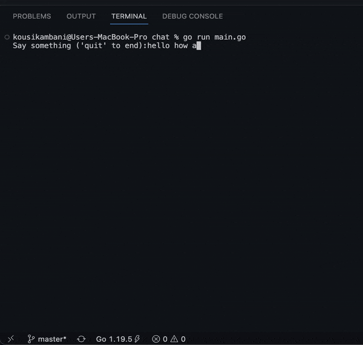

# Simple ChatGTP GO projects

## Only for learning purpose

Here I created 3 simple ChatGPT projects to experiment and learn about its scopes.

- Sentence completion
- Chat with GPT
- Library detector

    

## Features

- First project takes an incomplete line and return a new line with completing the input using AI.
- Second one is a cli chatbot, here you talk to chatGPT AI in the terminal.
- Third one reads a code and detects any libraries used in that code and write output to a new file

## Libraries I have used

- Viper (For env secrets reader)
- Cobra for cli
- go-gpt3 (ChatGPT client)
